# **프로젝트 : 맛조은테이블** 🍽️

<p align="center">
  
</p>

> 대한민국 모든 맛집이 한 곳에! **맛집 리뷰 플랫폼**

<br>

## 📌 시연 영상


> ⬆️ 이미지를 클릭하면 시연 영상으로 이동합니다.
[](https://www.youtube.com/watch?v=nMrofiLCaBsc)

<br>

---

## 📋 목차
- [1. 프로젝트 개요](#1-프로젝트-개요)
- [2. 프로젝트 구조](#2-프로젝트-구조)
- [3. 팀 구성 및 역할](#3-팀-구성-및-역할)
- [4. 기술 스택](#4-기술-스택)
- [5. 프로젝트 수행 경과](#5-프로젝트-수행-경과)
- [6. 핵심 기능 코드 리뷰](#6-핵심-기능-코드-리뷰)
- [7. 화면 UI](#7-화면-ui)
- [8. 자체 평가 의견](#8-자체-평가-의견)

---

<br>

## 1. 프로젝트 개요

### 1-1. 프로젝트 주제
- 맛집 리뷰 플랫폼 **"맛조은테이블"**

### 1-2. 주제 선정 배경
- 다양한 맛집 정보가 분산되어 있어 한눈에 비교하기 어려운 현실
- 신뢰할 수 있는 실사용자 리뷰 기반 맛집 추천 서비스의 필요성

### 1-3. 기획 의도
- 카테고리별(한식/중식/일식/양식) 맛집 탐색 및 사용자 리뷰 공유 플랫폼 구축
- 사장님 권한으로 직접 맛집 등록 및 메뉴 관리가 가능한 양방향 서비스

### 1-4. 활용 방안
- 사용자는 카테고리별 맛집을 탐색하고, 리뷰와 평점을 통해 맛집을 선택할 수 있습니다.
- 사장님 회원은 자신의 가게를 직접 등록하고 메뉴를 관리할 수 있습니다.

### 1-5. 기대효과
- 실리뷰 기반의 신뢰도 높은 맛집 정보 제공
- 지역 소상공인의 온라인 홍보 채널 확보

<br>

---

## 2. 프로젝트 구조

### 2-1. 주요 기능
| 구분 | 기능 |
|:---:|:---|
| 🏠 메인 | 인기 맛집 / 신규 맛집 / 리얼 리뷰 / 배너 슬라이드 |
| 🍴 맛집 | 카테고리별(한식/중식/일식/양식) 맛집 목록 / 인기 맛집 |
| 📍 맛집 상세 | 가게 정보 / 메뉴 / 리뷰 / 위치 표시 |
| 📝 리뷰 게시판 | 리뷰 CRUD / 평점 / 댓글 / 이미지 첨부 |
| 👤 회원 | 회원가입 (일반/사장님) / 로그인 / 마이페이지 / 정보수정 |
| 🔐 인증 | 세션 기반 인증 / 자동 로그인 (Remember Me) / 쿠키 토큰 |
| 🗺️ 지도 | 맛집 위치 지도 표시 |
| 🍜 메뉴 관리 | 사장님 메뉴 등록 / 메뉴 이미지 |
| 📢 공지사항 | 공지 목록 / 조회 |

### 2-2. 메뉴 구조도
<details>
  <summary>메뉴 구조도 펼치기</summary>

```
맛조은테이블
├── 메인 페이지
│   ├── 인기 맛집 (Top 10)
│   ├── 신규 맛집 (최신 6개)
│   ├── 리얼 리뷰 (최신 5개)
│   └── 배너 슬라이드
├── 맛집
│   ├── 맛집소개 (카테고리별 목록)
│   ├── 맛집지도
│   └── 인기맛집
├── 맛집 상세
│   ├── 가게 정보
│   ├── 메뉴 목록
│   ├── 리뷰 목록
│   └── 리뷰 작성 / 댓글
├── 커뮤니티
│   └── 공지사항
├── 회원서비스
│   ├── 로그인 / 로그아웃
│   ├── 회원가입 (일반 / 사장님)
│   └── 아이디 저장
└── 마이페이지
    ├── 내 정보 확인
    └── 회원정보 수정
```
</details>

<br>

---

## 3. 팀 구성 및 역할

| 이름 | 역할 | 담당 업무 |
|:---:|:---:|:---|
| **최영우** | 팀장 | • <!-- 담당 업무 --> |
| **정성준** | 팀원 | • <!-- 담당 업무 --> |
| **이효미** | 팀원 | • <!-- 담당 업무 --> |

> 💡 인원 : **3명** &nbsp;|&nbsp; 기간 : **2025.12 ~ 2026.01**

<br>

---

## 4. 기술 스택

### Frontend
<div align="left">
  
  
  
  
  
  
  
</div>

### Backend
<div align="left">
  
  
  
  
</div>

### Database
<div align="left">
  
</div>

### Tools
<div align="left">
  
  
  
</div>

### Architecture
```
TeamPeoject/
├── src/main/java/board/
│   ├── servlet/            ← 컨트롤러 (19개 서블릿)
│   ├── service/            ← 비즈니스 로직 (인터페이스 + 구현체)
│   ├── DAO/                ← 데이터 접근 계층 (10개 DAO)
│   ├── DTO/                ← 데이터 전송 객체 (10개 DTO)
│   ├── filter/             ← 인증 필터 (자동 로그인)
│   ├── exception/          ← 커스텀 예외
│   └── util/               ← 유틸리티
├── src/main/webapp/
│   ├── page/               ← JSP 뷰 (board, shop, user, menu, notice)
│   ├── layout/             ← 공통 레이아웃 (header, footer, gnb 등)
│   ├── static/             ← CSS, JS, 이미지
│   └── WEB-INF/web.xml     ← 서블릿 설정 (Jakarta Servlet 6.0)
└── SQL/                    ← DDL/DML 스크립트 (13개 테이블)
```

<br>

---

## 5. 프로젝트 수행 경과

### 5-1. 요구사항 정의서
<details>
  <summary>요구사항 정의서 펼치기</summary>

  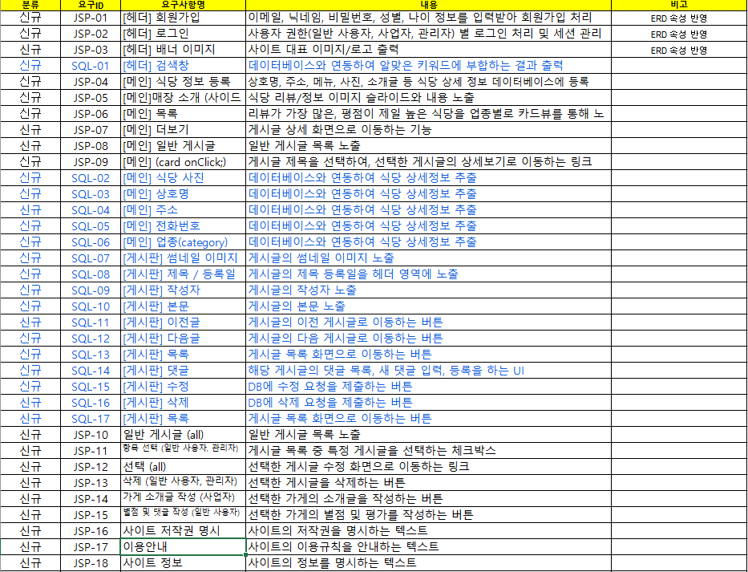
</details>

### 5-2. 기능 정의서
<details>
  <summary>기능 정의서 펼치기</summary>

  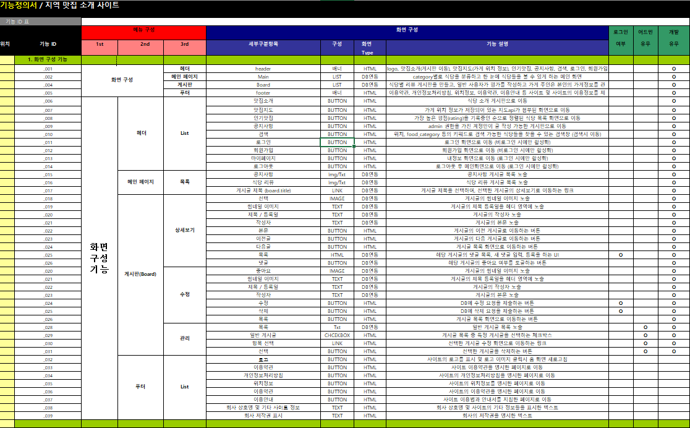
</details>

### 5-3. ERD
<details>
  <summary>ERD 펼치기</summary>

  
</details>

### 5-4. 활용 장비 및 프로그램
<details>
  <summary>활용 장비 및 프로그램 펼치기</summary>

  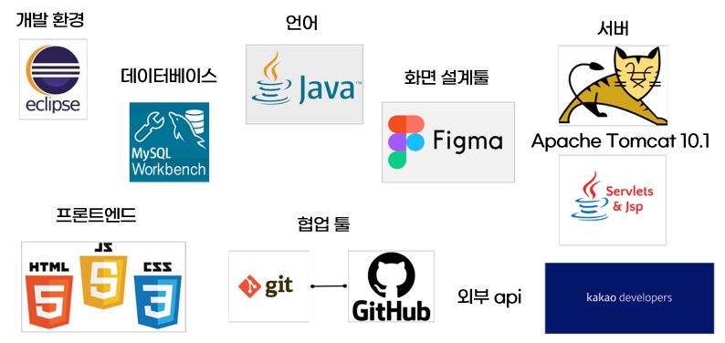
</details>

### 5-5. 플로우 차트
<details>
  <summary>플로우 차트 펼치기</summary>

  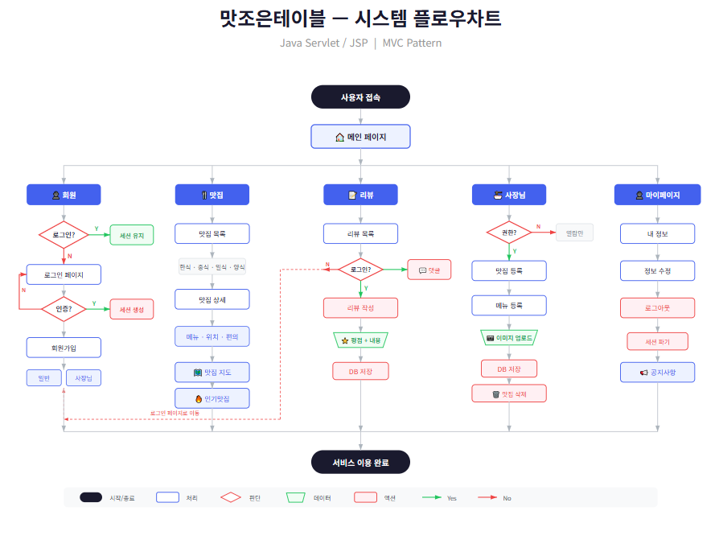
</details>

### 5-6. 간트 차트
<details>
  <summary>간트 차트 펼치기</summary>

  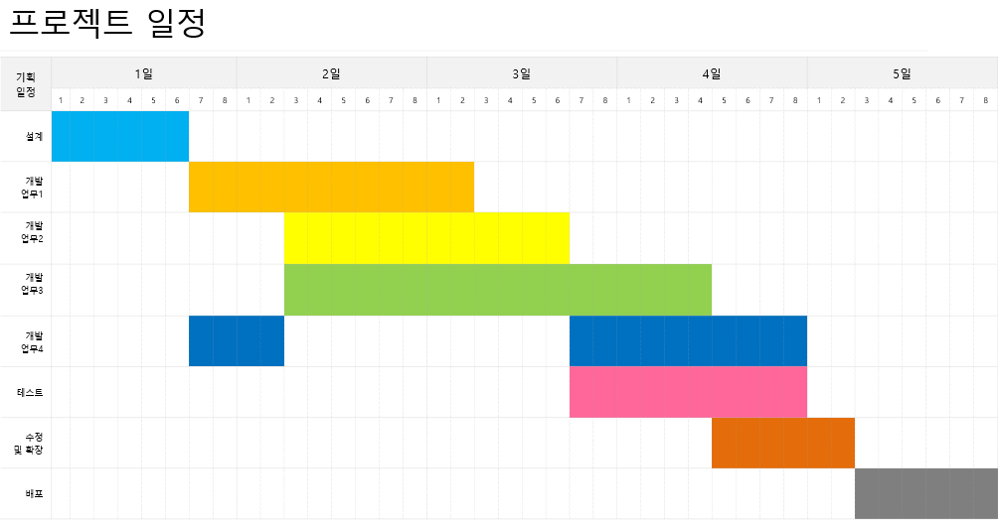
</details>

<br>

---

## 6. 핵심 기능 코드 리뷰

### 6-1. 자동 로그인 필터 (Remember Me)
> 쿠키 기반 토큰으로 자동 로그인을 처리하는 서블릿 필터

<details>
  <summary>코드 보기</summary>

```java
// LoginFilter.java - 자동 로그인 인증 처리
@WebFilter(description = "자동 로그인 등, 인증 처리 필터", urlPatterns = { "/*" })
public class LoginFilter extends HttpFilter implements Filter {

    PersistenceLoginsService persistenceLoginsService;
    UserService userService;

    public void init(FilterConfig fConfig) throws ServletException {
        persistenceLoginsService = new PersistenceLoginsServiceImpl();
        userService = new UserServiceImpl();
    }

    public void doFilter(ServletRequest request, ServletResponse response, 
                          FilterChain chain) throws IOException, ServletException {

        HttpServletRequest httpRequest = (HttpServletRequest) request;
        Cookie[] cookies = httpRequest.getCookies();

        String rememberMe = null;   // 자동 로그인 여부
        String token = null;        // 인증 토큰

        if (cookies != null) {
            for (Cookie cookie : cookies) {
                switch (cookie.getName()) {
                    case "rememberMe" : rememberMe = cookie.getValue(); break;
                    case "token"      : token = cookie.getValue(); break;
                }
            }
        }

        HttpSession session = httpRequest.getSession();
        User loginUser = (User) session.getAttribute("loginUser");

        // 자동 로그인 & 토큰 유효성 검증
        if ("on".equals(rememberMe) && token != null 
            && !token.isBlank() && loginUser == null) {

            PersistenceLogins pl = persistenceLoginsService.selectByToken(token);
            boolean isValid = persistenceLoginsService.isValid(token);

            if (pl != null && isValid) {
                loginUser = userService.selectByUserId(pl.getUserId());
                session.setAttribute("loginId", pl.getUserId());
                session.setAttribute("loginUser", loginUser);
            }
        }
        chain.doFilter(request, response);
    }
}
```
</details>

### 6-2. 맛집 카테고리별 목록 조회
> 음식 카테고리(한식/중식/일식/양식)별 맛집 필터링 서블릿

<details>
  <summary>코드 보기</summary>

```java
// ShopListServlet.java - 카테고리별 맛집 목록
@WebServlet("/shop/list")
public class ShopListServlet extends HttpServlet {

    private PlaceDAO placeDAO = new PlaceDAO();

    @Override
    protected void doGet(HttpServletRequest request, 
                         HttpServletResponse response) throws ServletException, IOException {
        String cate = request.getParameter("cate");
        List<Place> placeList;

        if (cate == null || cate.equals("all") || cate.isBlank()) {
            placeList = placeDAO.selectList();           // 전체 목록
        } else {
            int foodNo = Integer.parseInt(cate);
            placeList = placeDAO.selectListByFood(foodNo); // 카테고리별 필터
        }

        request.setAttribute("placeList", placeList);
        request.getRequestDispatcher("/page/shop/shop_list.jsp")
                .forward(request, response);
    }
}
```
</details>

### 6-3. 리뷰 작성 (평점 + 맛집 연동)
> 로그인 검증 후 맛집에 대한 리뷰와 평점을 등록하는 서블릿

<details>
  <summary>코드 보기</summary>

```java
// BoardWriteServlet.java - 리뷰 작성
@WebServlet("/board/write")
public class BoardWriteServlet extends HttpServlet {
    private BoardDAO boardDAO = new BoardDAO();

    protected void doPost(HttpServletRequest request, 
                          HttpServletResponse response) throws ServletException, IOException {
        request.setCharacterEncoding("UTF-8");

        HttpSession session = request.getSession();
        User loginUser = (User) session.getAttribute("loginUser");

        if (loginUser == null) {
            response.sendRedirect(request.getContextPath() + "/page/login.jsp");
            return;
        }

        String title = request.getParameter("title");
        String content = request.getParameter("content");
        String ratingStr = request.getParameter("rating");
        String placeNoStr = request.getParameter("place_no");

        BoardDTO board = new BoardDTO();
        board.setTitle(title);
        board.setContent(content);
        board.setUser_no(loginUser.getNo());

        if (placeNoStr != null && !placeNoStr.isEmpty()) {
            board.setPlace_no(Integer.parseInt(placeNoStr));
        }
        if (ratingStr != null && !ratingStr.isEmpty()) {
            board.setRating((int) Double.parseDouble(ratingStr));
        }

        int result = boardDAO.insert(board);

        if (result > 0) {
            response.sendRedirect(
                request.getContextPath() + "/place/view?no=" + placeNoStr
            );
        }
    }
}
```
</details>

<br>

---

## 7. 화면 UI

### 7-1. 메인 페이지
<details>
  <summary>메인 페이지 펼치기</summary>

  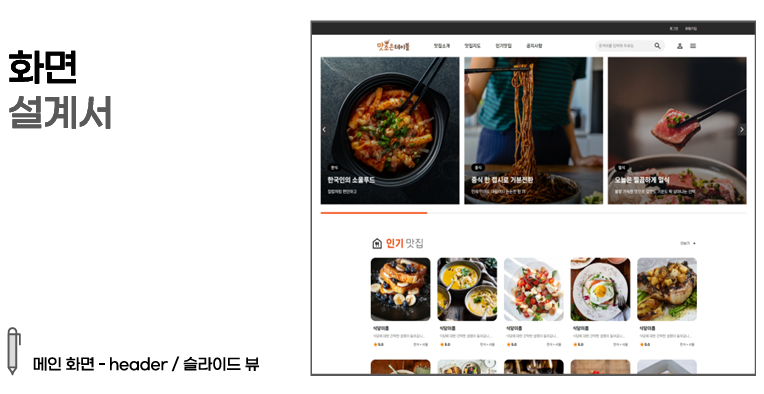
  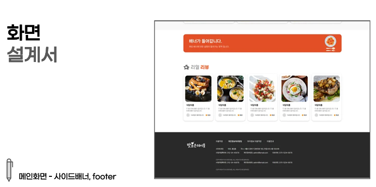
</details>

### 7-2. 맛집 목록
<details>
  <summary>맛집 목록 펼치기</summary>

  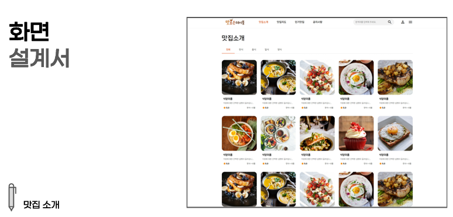
  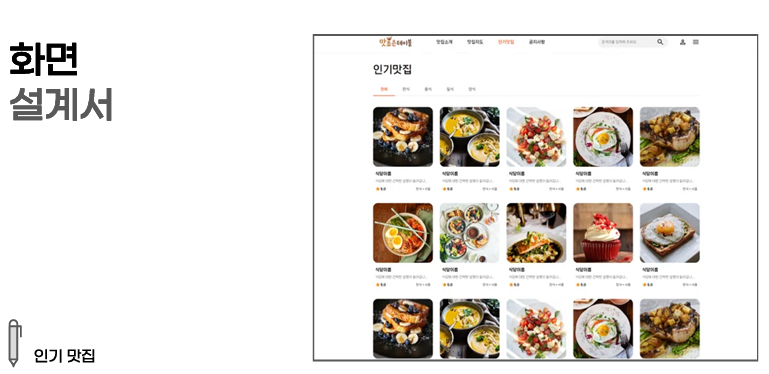
</details>

### 7-3. 맛집 상세
<details>
  <summary>맛집 상세 펼치기</summary>

  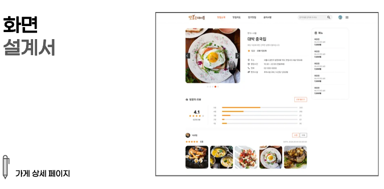
</details>

### 7-4. 로그인 / 회원가입
<details>
  <summary>로그인 / 회원가입 펼치기</summary>

  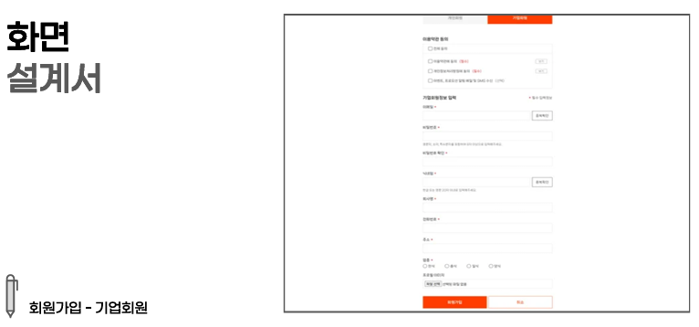
  
  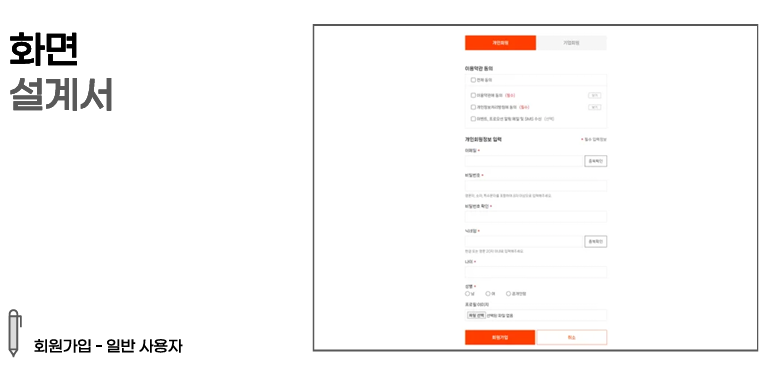
</details>

### 7-5. 마이페이지
<details>
  <summary>마이페이지 펼치기</summary>

  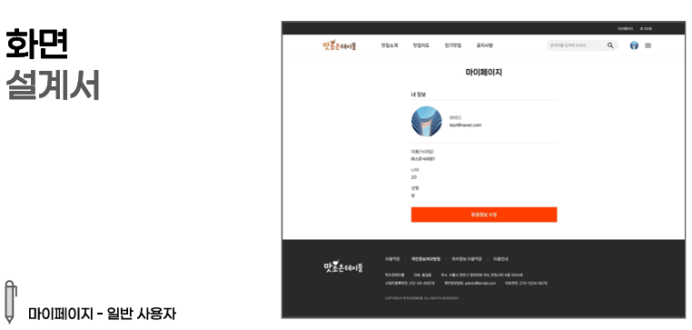
  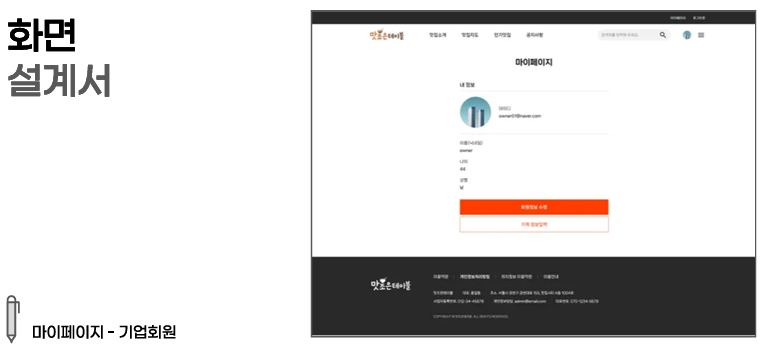
  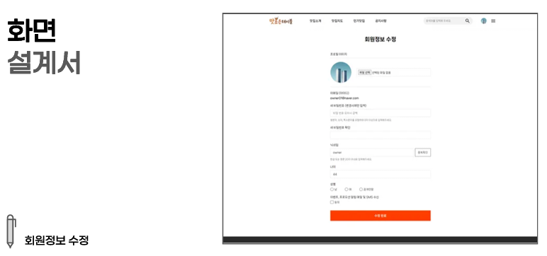
</details>

### 7-6. 맛집 지도
<details>
  <summary>맛집 지도 펼치기</summary>

  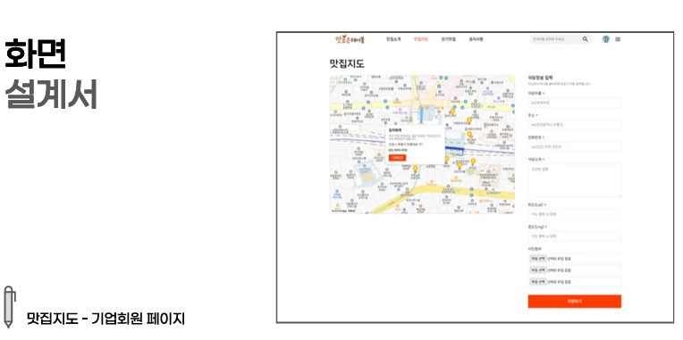
  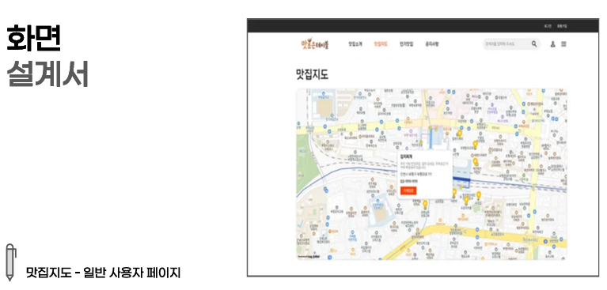
</details>

<br>

---

## 8. 자체 평가 의견

### 잘한 점
- Jakarta Servlet 6.0 기반 MVC 패턴을 적용하여 컨트롤러/서비스/DAO 계층을 분리하고, 유지보수성을 확보함
- 쿠키 + 토큰 기반의 자동 로그인(Remember Me) 기능을 필터로 구현하여 서블릿 라이프사이클에 대한 이해를 심화함

### 아쉬운 점
- <!-- 아쉬운 점 작성 -->

### 개선할 점
- <!-- 개선할 점 작성 -->

<br>

---

<p align="center">
  
  &nbsp;
  
  &nbsp;
  
  &nbsp;
  
</p>